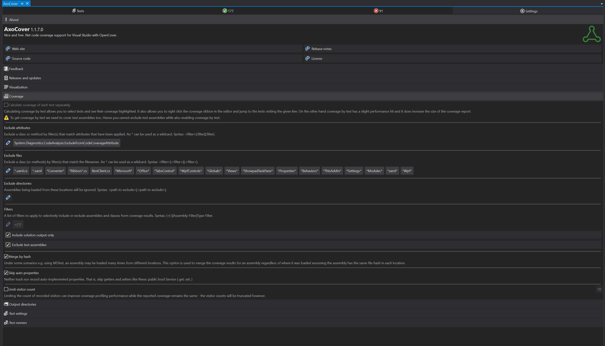

We started measuring code coverage and one of my colleagues found this nice tool called AxoCover.

It allows you to filter what you want to cover, it has a simple UI and most importantly...it's open source and free to use!

To be honest, filtering is easier with dotCover, but once you fiddle with it you begin to understand how it works.
For example, I don't want my xaml files and the code behind to be covered by tests, so I use this filter:

_`*.xaml.cs*`;`*.xaml*`;_

I also don't want any converters to be covered by tests, so I use this filter:

_`*Converter*`;_

If you want to try it, you need to download their [Visual Studio extension](https://marketplace.visualstudio.com/items?itemName=axodox1.AxoCover). After you install it just go to Tools -> AxoCover and you may need to do a build before your tests appear.

PS: Check out their [Github page](https://github.com/axodox/AxoCover) and maybe you can also contribute.
