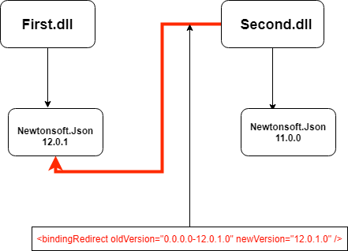

Today I had to fix this issue:
```
Could not load file or assembly 'Newtonsoft.Json, Version=12.0.1.0, Culture=neutral, PublicKeyToken=30ad4fe6b2a6aeed' or one of its dependencies.
The located assembly's manifest definition does not match the assembly reference. (Exception from HRESULT: 0x80131040)

``` 

As some of you may have guessed, two of my libraries were using Newtonsoft.Json, but they required different versions of it. Visual Studio generated a binding redirect that looked like this:

```
<runtime>
    <assemblyBinding xmlns="urn:schemas-microsoft-com:asm.v1">
      <dependentAssembly>
        <assemblyIdentity name="Newtonsoft.Json" publicKeyToken="30ad4fe6b2a6aeed" culture="neutral" />
        <bindingRedirect oldVersion="0.0.0.0-12.0.1.0" newVersion="12.0.1.0" />
      </dependentAssembly>
    </assemblyBinding>
  </runtime>

```

In development it works ok, and also when you're doing a fresh install because the app.config gets copied with the rest of the files. On upgrade however, the .config file was not replaced because Wix won't overwrite files that have been modified since the last version was installed. First I thought this is a bug but it's actually a feature. Imagine that in your app.config you're storing some settings, then if you overwrite it you'll lose them on every application upgrade. So in order to fix this I had to change only the part with the `'<runtime>'` xml, not the entire xml file.

In order to do this I used a CustomAction from Wix. You have to declare it in your .wxs file and then the action is invoked during install. Here's how my CustomAction looks like:

`gist:thewindev/9d136b2065e07b211bc7c7eaf007411c`

Now if the config exists, we'll replace the entire xml text of the `'<runtime>'` with the one that we want, thus keeping the old contents of the .config and only replacing the bindings.